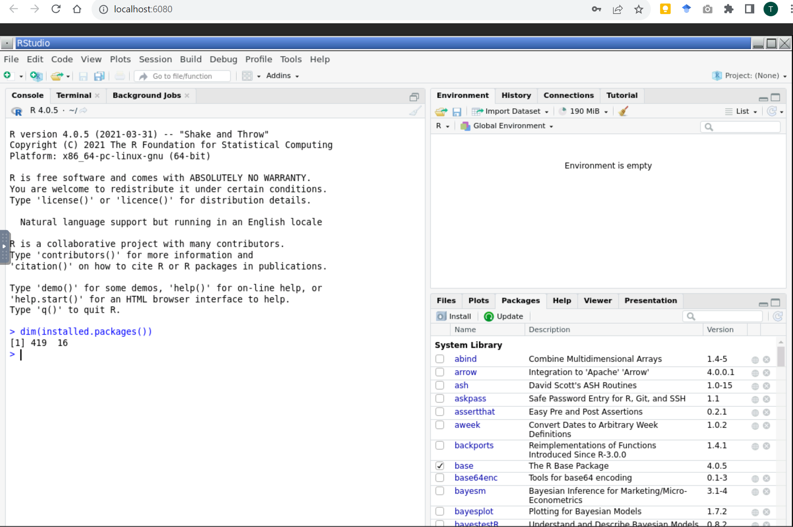

# Test OS devcontainer using desktop-lite

* Open this repo in VS Code
* When prompted select to build the devcontainer
* The desktop environment is accessed in a browser at <http://localhost:6080/>  
  

  The password is: `vscode`

* Right click on the desktop to access programs like File Manager and Terminal  
  

* When you first launch Terminal you may see this error message, I find simply clicking to *Add terminal down* starts a new Terminal that works (or click on *Create a new session*)
  

* To save files in the desktop environment into this repo the directory path is `/workspaces/{repo-name}` so `/workspaces/os-test-desktop-lite` for this repo.

* In this repo in the desktop environment we are running as root, so we have to launch GitHub Desktop and RStudio Desktop with the `--no-sandbox` flag from the Tilix Terminal
  ```
  github-desktop --no-sandox
  rstudio --no-sandbox
  ```

* Here are screenshots of them running
    
  

* The Stata graphical environment is started from a Terminal with
  ```
  /usr/local/stata17/xstata-mp
  ```  
  

## Helpful references

* https://github.com/devcontainers/features/tree/main/src/desktop-lite
* https://code.visualstudio.com/docs/devcontainers/create-dev-container
